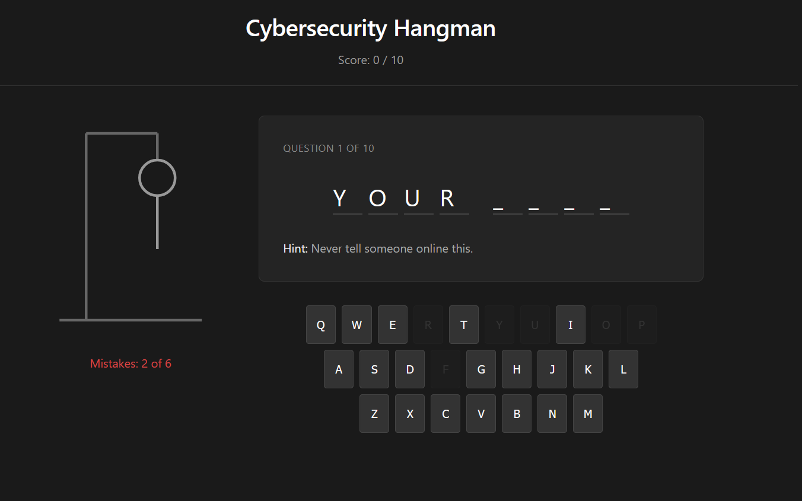

# Cybersecurity Hangman Game

A web-based educational game that teaches online safety through interactive hangman gameplay.

## Description

Learn cybersecurity concepts while playing hangman. Each question teaches important lessons about passwords, phishing, personal information, and digital safety.

## Visit the Website

## [Cybersecurity Hangman Game](https://cybersecurity-hangman-game.vercel.app/)

### Installation

1. **Clone the repository**

   ```bash
   git clone https://github.com/maheshhattimare/cybersecurity-hangman-game.git
   cd cybersecurity-hangman-game
   ```

2. **Install dependencies**

   ```bash
   npm install
   # or
   yarn install
   ```

3. **Start the development server**

   ```bash
   npm start
   # or
   yarn start
   ```

4. **Open your browser**
   Navigate to `http://localhost:5173` to play the game

### Building for Production

```bash
npm run build
# or
yarn build
```

## How to Play

1. Read the hint provided for each question
2. Click letters to guess the hidden word
3. Each wrong guess adds a part to the hangman
4. Complete all 10 questions and track your score
5. Learn valuable cybersecurity tips after each answer

## Tech Stack

- React 18
- Vite
- JavaScript

## Screenshots


